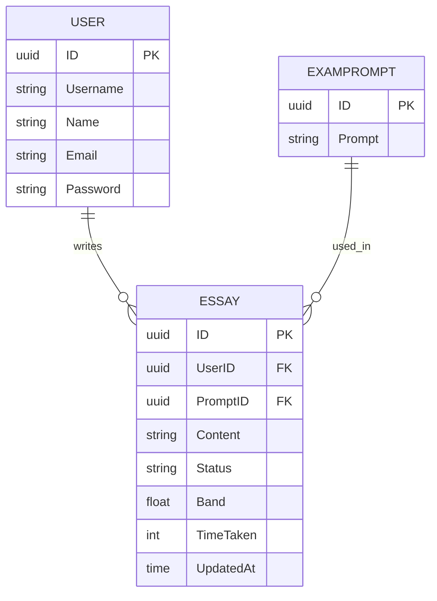

```mermaid
erDiagram
    USER ||--o{ ESSAY : writes
    EXAMPROMPT ||--o{ ESSAY : used_in

    USER {
        uuid ID PK
        string Username
        string Name
        string Email
        string Password
    }

    EXAMPROMPT {
        uuid ID PK
        string Prompt
    }

    ESSAY {
        uuid ID PK
        uuid UserID FK
        uuid PromptID FK
        string Content
        string Status
        float Band
        int TimeTaken
        time UpdatedAt
    }
```
